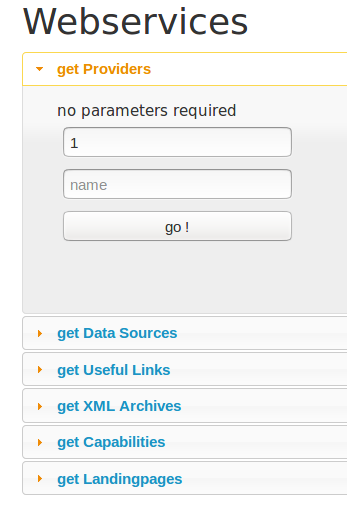

#  BioCASe Monitor 2.1

The BMS is a web application relying on jQuery 2.1.4, Bootstrap 3.3.7 and a Sqlite3 Database.
It is designed to be a GUI aggregation tool for different BioCASe Provider Software installations (BPS).
There are 3 entry points: for the backend, the frontend, and the webservices.
Each entrypoint is a  index.php file which acts as a controller for dispatching the routes,
and builds the html skeleton. 
Further processing is managed by a javascript file defining functions to populate the skeleton.

The database holds general metadata about the data providers,  infos about the data to be fetched, 
and expert knowledge about the schemas, their concepts, their mappings, and the rules to be applied.
Furthermore, credentials for the backend access are stored here.

## How to read this document

This document is targeting an administrator who understands the code
and eventually wants to modify it, beit for bug fixing or enhancements.

Please have a look at the API documentation generated by doxygen. 
In the config/custom folder there is a sample Doxyfile, in case you want to rebuild the doc.

The API documentation is available in Html and Pdf:   
HTML: [API html doc](api/html/index.html)     
PDF: [API pdf doc](api/latex/refman.pdf)      

## Notations
Throughout this document, we use some special abbreviations and terms:

- BPS: BioCASe Provider Software
- BMS: BioCASe Monitoring Service
- DSA: DataSource Access Point
- CountConcept: an element of which the occurrences are counted

- CRUD: create, read, update, delete

## Database

We use SQLite3 as database management system. 
For some modifications, such as for editinmg schemas, mappings and rules, there is no GUI, 
so you need to get directly into the DB, using your preferred UI.

Infos of the Data Providers include:

- id, name, shortname, institution Url, BPS Url, status
- Datasource access points
- Concepts to be counted
- XML archives
- useful links

Expert Knowledge:

- schemas with shortname and Urn
- mappings between schemas
- mapped elements for each schema mapping
- rules for each schema element

## Backend

Access to the backend is only granted to registered users. 
Each user has only editing permissions to his associated data provider.
The basic metadata, the count concepts and the Datasource Access Points, 
together with their archives and useful links, are loaded from the database
and displayed in a tabbed view.
For each Datasource access point (DSA) CURL requests are made to the BPS, 
in order to help to fill in the needed additional data from a dropdown-list
such as the BPS Url, the DataSet, and the schema.
The only field with free text input is the title field.
These CURL requests are operated by a PHP script and launched via AJAX. 
There are about 6 AJAX requests per DSA,
so depending on the response time of the BPS server, you will have to wait a few seconds.
A progress bar showing the pending AJAX requests is displayed in real time.

### in progress...
We are working on a solution where AJAX requests are only made when opening a tab.

The backend has CRUD functionalities to manage DSAs.
The CRUD functions are written in PHP, with PDO to access the database.
They are called via AJAX, and triggered by click events on the appropriate buttons.
They follow a naming convention: [get|add|remove|update]XXX.php

example:   
PHP: [addDSA](api/html/add_d_s_a_8php.html)    
Javascript: [addDSA](api/html/backend_8js.html#ab2defb5f9c70cf24da0dca77cadcdd4c)   

### How to fill in a Data Source Access point

The most important thing to be checked is the correct URLsof the BPS installation, 
in the Basic Metadata section. This URL is used to build the complete URL of a DataSource Access point (DSA),
by appending  `/pywrapper.cgi?dsa=myDataSource` where `myDataSource` has been selecte din the dropdown list above.
Since for a given DataSource there can be several DataSets, the possible Datasets are displayed in a dropdown list.
The Archives are just URLs. Please make sure that there is one archive marked as 'latest'.
The Useful Links are URLs, too. with an addtional specification for the type (GBIF, etc).

## Frontend

## Webservices

We provide a GUI and a REST API for webservices:

- capabilities
- citations
- data-sources
- landingpages
- providers
- total-records
- useful-links
- xml-archives

For each webservice, there is a folder with the service name 
containing an `index.php` file  which generates and outputs a JSON response.
Either the Database or the BPS or both are used as 
